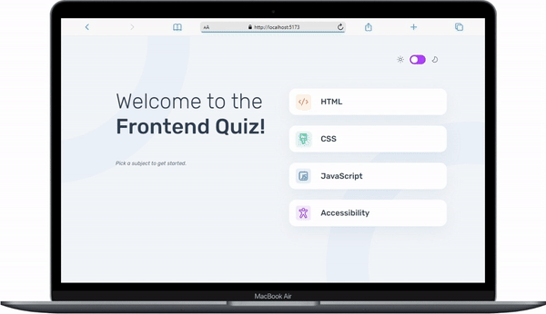

# Frontend Quiz APP

A quiz application built with React, TypeScript, and Vite. The app is designed to be navigable using the keyboard, allowing users to select topics and answer options using character keys and submit their answers using the Enter or Spacebar keys.

## Table of Contents
- [Demo](#demo)
- [Features](#features)
- [Technologies Used](#technologies-used)
- [Installation](#installation)
- [Usage](#usage)
- [Keyboard Navigation](#keyboard-navigation)
- [License](#license)


## Demo


## Features
- Keyboard-only navigation.
- Instant feedback on answer submision.
- Multiple quizzes with varying topics or subjects.
- Light/Dark mode support

## Technologies Used
- **React**: A JavaScript library for building user interfaces.
- **TypeScript**: A superset of JavaScript that adds static typing.
- **Vite**: A fast build tool for modern web projects.
- **React Router**: For navigation and routing within the app.
- **React Context**: For managing the app's state.
- **Styled Components**: For scoped and modular CSS styles.
- **ESLint**: Linter for identifying and fixing code quality issues.
- **Prettier**: Code formatter for maintaining consistent code style.
- **Jest**: Testing framework for writing unit and integration tests."

## Installation
1. Clone the repository:
   ```sh
   git clone https://github.com/JUSTICEOWUSU/frontend-quiz-app.git

2. Navigate to the project directory:
    ```sh
    cd frontend-quiz-app

3. Install dependencies:
    ```sh
    npm install

## Usage
1. Start the development server
    ```sh
    npm run dev

2. Open your browser and navigate to http://localhost:5173.

## Keyboard Navigation (case insensitive)
The quiz app is designed to be fully navigable using the keyboard. Below are the key bindings:

### Topic Selection:
- Press "U",Tab or any Arrow key to navigate through the various topics.
- Press Enter or Spacebar to select or click on the selected topic.

### Answer Selection:
- Press "A" to select option A.
- Press "B" to select option B.
- Press "C" to select option C.
- Press "D" to select option D.

### Submit Answer:
- Press "U", Enter or Tab to focus/select the "submit answer" button
- Press Enter or Spacebar to submit the selected answer.

### Move to Next:
- Press "U", Enter or Tab to focus/select the "next-question" button if not already focused/selected
- Press Enter or Spacebar to go to next question.

### Completing the Quiz:
1. Repeat the steps for selecting an answer and submitting an answer until you complete the quiz.
2. Your score will be displayed at the end.

### Play Again:
- Press "U", Spacebar, Enter or Tab to focus/select the "play again" button.
- Press Enter or Spacebar to start a new quize.

### Switch between Light/Dark mode:
- Press "L" to focus/select the Light/dark mode switch.
- Press Enter or Spacebar to switch between modes.
- Press "U" key to defocus/deselect the switch when satisfied.


### Example Walkthrough
1. **Starting the App**: Upon loading the quiz app, the menu page with various subjects is displayed.

2. **Selecting a Topic**:
   - Use the "U" key, Tab, or Arrow keys to navigate through the list of topics.
   - Once a topic is highlighted, press Enter or Spacebar to select it.

3. **Starting the Quiz**: After selecting a topic, the first question related to that topic is displayed.

4. **Selecting an Answer**:
   - Read the question and consider the answer options labeled A, B, C, and D.
   - Press the key "A" to select option A, "B" to select option B, "C" to select option C, or "D" to select option D.

5. **Submitting an Answer**:
   - After choosing an answer, press "U", Enter, or Tab to move focus to the "submit answer" button.
   - Press Enter or Spacebar to submit your chosen answer.
   - The app provides instant feedback, indicating whether the answer was correct or incorrect, and then displays the "next-question" button.

6. **Moving to the Next Question**:
   - If the "next question" button is not already focused, press "U", Enter, or Tab to focus on it.
   - Press Enter or Spacebar to proceed to the next question.

7. **Completing the Quiz**:
   - Continue answering the questions following the same process.
   - Upon completing all the questions, your final score will be displayed.

8. **Play Again**
  - After seeing your result and you want to do another quiz, press "U", Spacebar, Enter or Tab to focus/select the "play again" button
  - Press Enter or Spacebar to start a new quize.


## Expanding the ESLint configuration
If you are developing a production application, we recommend updating the configuration to enable type aware lint rules:

- Configure the top-level `parserOptions` property like this:

```js
export default {
  // other rules...
  parserOptions: {
    ecmaVersion: 'latest',
    sourceType: 'module',
    project: ['./tsconfig.json', './tsconfig.node.json'],
    tsconfigRootDir: __dirname,
  },
}
```

- Replace `plugin:@typescript-eslint/recommended` to `plugin:@typescript-eslint/recommended-type-checked` or `plugin:@typescript-eslint/strict-type-checked`
- Optionally add `plugin:@typescript-eslint/stylistic-type-checked`
- Install [eslint-plugin-react](https://github.com/jsx-eslint/eslint-plugin-react) and add `plugin:react/recommended` & `plugin:react/jsx-runtime` to the `extends` list


## License
This project is licensed under the MIT License. See the [LICENSE](./LICENSE) file for details.
